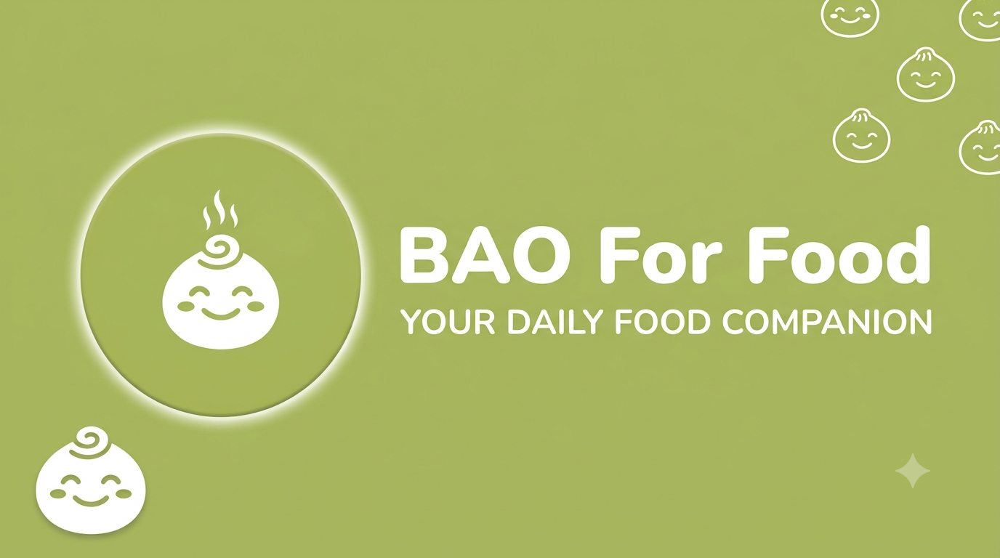

  

<h1 align="center">BAO For Food</h1>

  <strong>Not sure what to eat today? Let BAO choose with you.</strong>

  A mobile companion that makes choosing where to eat every day faster, easier, and more enjoyable.

## What is BAO?

BAO For Food is a mobile app for those moments when you are hungry but cannot decide what to eat. Instead of spending time scrolling through endless options, BAO suggests a restaurant so you can make a decision faster.

The app focuses on the details that matter when choosing a place to eat: location, opening status, price range, ratings, photos, and directions.

## The BAO experience

1. Open BAO and select **“What should I eat today?”**
2. Share your location for more relevant nearby suggestions, or continue without sharing it.
3. Explore BAO's restaurant suggestion and its essential details.
4. Open the map and head there, save the restaurant for later, or ask BAO for another option.

## What BAO can do for you

- Suggest a restaurant for today based on your current area.
- Show whether a restaurant is open or closed before you leave.
- Provide ratings, review counts, and estimated price ranges at a glance.
- Let you explore restaurant photos, addresses, and available amenities.
- Open directions to the restaurant on a map.
- Offer another suggestion when the current choice does not match your mood.
- Save favorite restaurants and revisit places you have explored.
- Personalize your experience with your own profile.

## Made for days when...

- You and your coworkers spend too long deciding where to have lunch.
- You want to discover a new restaurant nearby.
- You need a quick answer instead of more choices.
- You want to save interesting places for another day.

## Product personality

BAO is designed to feel **friendly, approachable, and cheerful**. Green brings a fresh and natural feeling, orange adds a warm accent, and the smiling bao mascot feels like a little companion that is always ready to answer one familiar question:

> “What should I eat today?”

## Platforms

BAO is designed as a mobile-first experience for both **Android** and **iOS**.

## Project status

BAO For Food is currently under active development as its experience continues to grow and improve.

---

  <strong>BAO For Food — Your daily food companion.</strong>

